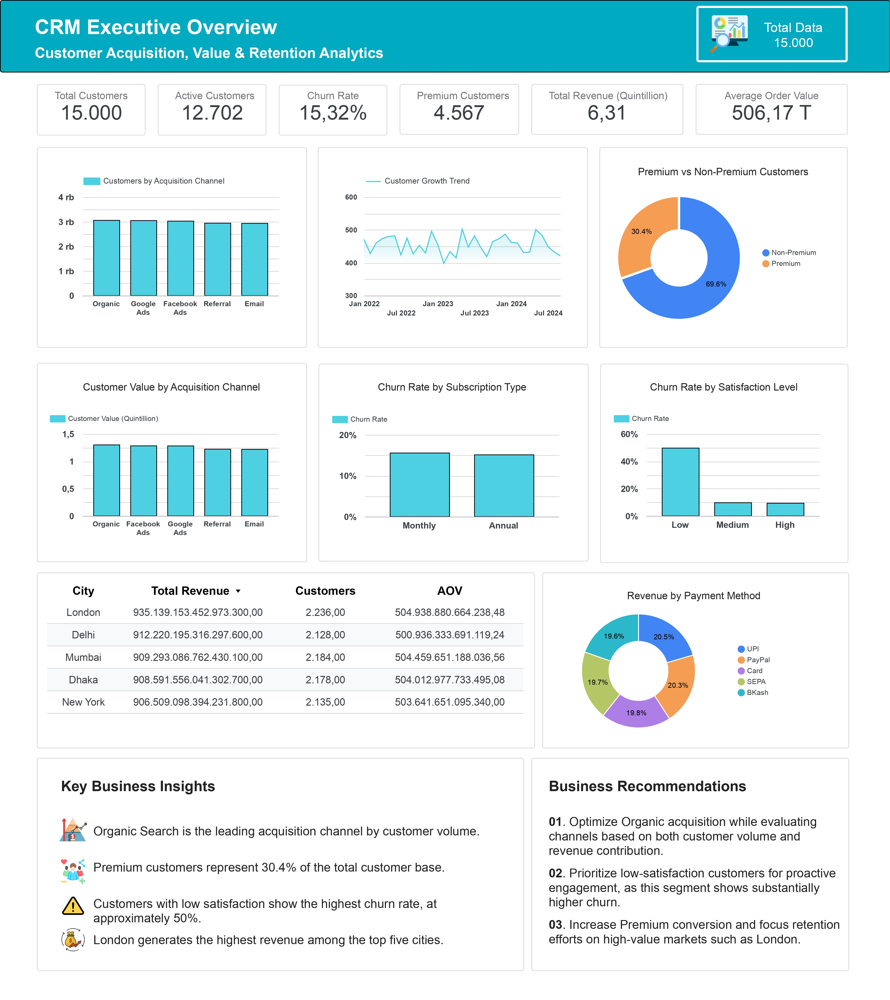

  

## Bachelor's Degree in Computer Science - Pamulang University
## Data Analyst | Performance | CRM Analytics

I am a Computer Science graduate with a strong interest in **Data Analytics, CRM Analytics, and Business Intelligence**.
I focus on transforming raw and messy data into meaningful insights that can support business decision-making.

### Skills & Tools
- Programming: Python, SQL
- Data Analysis: Pandas, NumPy, Excel, Google Sheets
- Database: SQL Server, MySQL, PostgreSQL
- Data Visualization: Looker Studio, Power BI, Matplotlib, Seaborn
- Machine Learning: Scikit-learn (Naive Bayes, Random Forest)
- Tools: Jupyter Lab, VS Code, GitHub

### Projects
CRM Customer Analytics

Description:
Performed end-to-end customer analytics to analyze **customer acquisition, customer value, revenue, and retention performance**.

### Features:
- Data quality assessment and validation
- Data cleaning and transformation
- Customer acquisition analysis
- Customer and revenue analysis
- Churn and retention analysis
- Business insights and recommendations
- Interactive executive dashboard

### Tech Stack:
SQL Server, Excel, Google Sheets, Looker Studio

### Data Analysis & Dashboard
Description:
Performed data analysis and presented insights through an interactive dashboard.

## Features:
- Data cleaning & preprocessing
- Trend analysis and visualization
- Dashboard built using Looker Studio

### Currently Learning
- Deep Learning
- Data Engineering
- Advanced Machine Learning

### Contact
📧 Email: ahnafirfanbarianto@gmail.com
🌐 GitHub: https://github.com/ahnafirfan20

### Career Goals
To become a professional Data Scientist / Data Analyst who can deliver impactful, data-driven insights for business decision-making.
